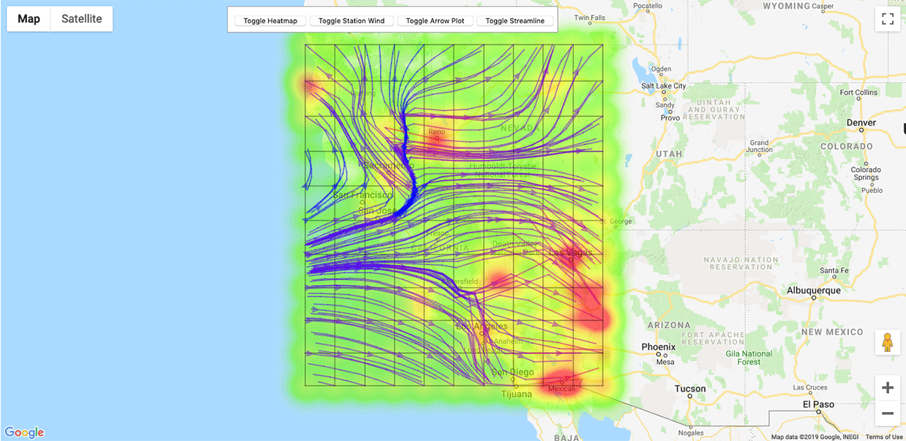

# Real Time Wind Map

Technology Used:
* HTML
* CSS
* JavaScript
* [OpenWeatherMap API](https://openweathermap.org/api)
* [Maps JavaScript API](https://developers.google.com/maps/documentation/javascript/reference/)

## Timelapse of One Night's Wind Pattern

